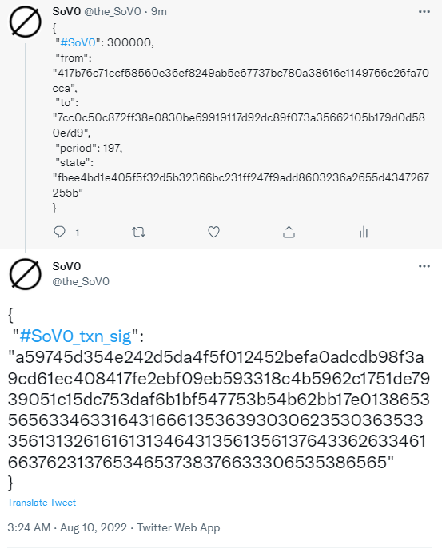
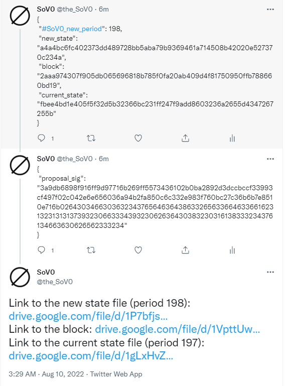

# SoV0: a fixed-supply zero-fee cryptocurrency
SoV0 is a cryptocurrency optimized purely for being a store-of-value. SoV0’s design is simple: just a publicly-maintained text file documenting who owns how many units of some abstract asset, plus a rudimentary transaction system. SoV0 is too slow to be a general purpose payments platform, has no smart contract support, and certainly can't function as a currency. SoV0 intentionally adopts this limited functionality in order to achieve 0 supply growth and 0 fees (unlike all existing assets), with the long-term goal of becoming a singularly compelling coordinated value store.

- [1. Overview](#1-overview)
- [2. Value](#2-value)
- [3. Design](#3-design)
- [4. Distribution](#4-distribution)
- [Appendix A. Initial Protocol](#a-initial-protocol)
- [Appendix B. Code Usage Guide](#b-code-usage-guide)
- [Appendix C. Relationship to Existing Blockchains](#c-relationship-to-existing-blockchains)


## 1. Overview
The purpose of a store of value is to preserve value across time.  Supply growth and fees are detrimental to this purpose: fees directly cut into how much you own, and supply growth drives down the value of your holdings.  All existing assets suffer from one or the other.  Some examples:

- Fiat currencies (e.g. dollars) experience supply growth, as governments can print money infinitely.
- Stocks experience supply growth, as companies are free to issue more stock.
- Gold & other precious metals experience supply growth due to discovery of new deposits (e.g. asteroid mining), plus costs associated with safekeeping.
- Housing experiences supply growth from new construction and fees from ongoing maintenance.
- Existing blockchain-based assets all have transaction fees and/or supply growth, which serve to incentivize proper system operation.

SoV0 is a blockchain that aims to overcome the limitations of fees & supply growth by explicitly disavowing all functionality beyond being just a store of value.  SoV0's design is correspondingly simple: just a text file that tracks ownership of some abstract asset, plus a minimal transaction system.  This extreme simplicity then:

- allows SoV0 to achieve 0 supply growth and 0 fees, by circumventing the need for explicit monetary incentives that would otherwise be necessary for ensuring proper operation in more complicated systems.
- positions SoV0 as a natural coordination point (which is essential for long-term value), given its salience as the simplest possible thing that can achieve 0 supply growth and 0 fees.

At a high level, SoV0's **initial design**  is just this:

1. There is a publicly accessible state file that lists who owns how many units of the SoV0 asset.
2. Users submit transaction requests (to send assets from one account to another) by just posting to Twitter.
2. Once per week, a pre-designated operator gathers up transactions into a block & proposes to use these transactions to update the state file.
3. In the event of operator misbehavior (e.g. they try to create assets out of thin air for themselves), the update is rejected & the operator is replaced with the next-in-line one.

The next few sections discuss SoV0's value proposition, initial design, and how this design will evolve going forward to achieve better scalability & decentralization.


## 2. Value
Value is fundamentally about coordination: something is valuable if people agree that it's valuable.  One way to generate this coordination is by being (1) scarce, (2) persistent, and (3) compelling.

- Gold is a prime example: it's naturally scarce, quite persistent given its lack of corrosion (though safekeeping costs may be substantial), and compellingly shiny. Thus, gold is a natural coordination point, and thus valuable.
- Bitcoin is another example: it has capped asset supply, is quite persistent (though you lose some holdings to transaction fees), and is compelling on account of being potentially the simplest possible realization of a payment system.  This makes Bitcoin a natural coordination point, and thus valuable.
- Memecoins / NFTs are less perfect examples: specific dog memes / ape pictures may be compelling for a period of time, but long-term staying power is a concern.

SoV0 aims to generate coordination (and thus value) by satisfying these three conditions to the fullest extent possible:

1. Scarce: SoV0 achieves the 0 supply growth limit (fixed asset supply).
2. Persistent: SoV0 achieves the 0 fee limit (no 'corrosion' due to fees).
3. Compelling: SoV0 aims to be both the first and simplest thing that can implement 0 supply growth and 0 fees, and being situated in this this prime location in the space of all assets makes it fundamentally compelling.

To put it another way:  SoV0 aims to take the value proposition underlying gold and push it to its logical conclusion.  Value is a coordinated fiction, and gold is valuable because it's a very natural coordination point.  SoV0 aims to be an even more natural coordination point: it achieves the limit when it comes to scarcity & persistence (0 supply growth and 0 fees), and has the natural salience that comes with being both the first & simplest possible thing to achieve this.  

This coordination will necessarily be a longer-term process: there will be limited initial coordination owing to SoV0's novelty, with increasing coordination coming over time, conditional on SoV0's unique properties becoming more broadly appreciated.


## 3. Design
SoV0's initial design is particularly simple.  This initial design emphasizes the most novel aspect of SoV0: how to satisfy basic transaction functionality while implementing 0 supply growth & 0 fees.  Future iterations of the design will focus on improving scalability & decentralization (for which there is a large body of existing approaches sufficient for SoV0's purposes).  For more discussion of the principles behind SoV0's design & how SoV0 relates to existing blockchains, see [Appendix C](#c-relationship-to-existing-blockchains).


### 3.1. Initial design

All SoV0 does is maintain a 'state file' (i.e. a text file with the balances of every account), and update the state file via a block of transactions that satisfy some rules (e.g. move balance from one account to another only if the transaction is authorized by the sender).  In its initial phase, SoV0 will work like this:

- Users submit signed transactions (to send some of their assets to other users) by just posting to Twitter.
    - Each transaction must contain the sender and receiver addresses, the amount to send, and also the current SoV0 period & hash of the state file in this period (a 64-length hexadecimal string that almost certainly uniquely identifies the state file).
- Once per period (= week), the block producer gathers up the transactions from Twitter, puts them into a block, and proposes that this block be used to update the state file.  The block producer then circulates the block and posts this 'state update proposal' to Twitter.
- The community gets together and checks that the block producer behaved properly by running some simple code to verify that the block is valid and that the new state does in fact have the hash listed in the state update proposal.
- If the block producer misbehaves (e.g. posts an invalid state update proposal, or proposes an invalid block, or fails to post a state update proposal on time, or posts multiple state update proposals), then the protocol stipulates that all state update proposal for this period should be rejected, and the state should instead update without a block.
    - In this case, all the accounts and balances remain unchanged, and the current block producer is removed & replaced with the next-in-line account.
    - A majority of users (by total balance) can also at any point petition to remove the current block producer, in which case the state also updates without a block.

The full protocol details [may be found in Appendix A](#a-phase-1-protocol). The reference code implementation is a mere \~1500 lines of simple Python with a single non-standard-library dependency (see the [code usage guide in Appendix B](#b-code-usage-guide) for more details).

Here's how the simplicity of SoV0's design allows it to implement 0 fees and 0 supply growth:

- Existing blockchains use fees as a way of determining which transactions get prioritized for inclusion in a block.
    - SoV0 sidesteps this by being intentionally coarse: every single valid transaction can fit into a block, as SoV0 has a limited number of indivisible assets that can each only be sent once per period.
- Existing blockchains that have smart contract functionality need some sort of a 'gas fee' for preventing seemingly-valid-but-actually-not smart contracts from wasting operators' compute resources.
    - SoV0 has no smart contract functionality.
- Existing blockchains that optimize for high performance may incur significant operating costs that have to be covered via monetary rewards.
    - SoV0 has extremely modest operational costs given its intentionally limited functionality.
- Existing blockchains provide rewards for proof of stake / work as a means of incentivizing coordination on correct blockchain state (i.e. reward for mining/validating on the correct chain, possible punishment if wrong chain).
    - SoV0 instead uses transactions to directly generate this coordination: users must include the hash of the current SoV0 state file in their transactions & may be temporarily banned from sending transactions if they include an incorrect hash.  This incentivizes coordination on the true SoV0 state in much the same way as monetary rewards.

SoV0's current design has some limitations in terms of scalability and decentralization, which will be addressed in future iterations of SoV0's design (see [Section 3.2 below](#32-future-developments)).

It should be noted that, despite this initial design's limited decentralization, SoV0 achieves some of the associated robustness benefits via an additional approach: avoiding conflict with powerful institutions wherever possible.  In particular:

- SoV0 doesn't threaten government control over payments or currency (too slow & too coarse).
- SoV0 doesn't generate systemic financial risk (no smart contracting / DeFi).
- SoV0 doesn't compete for energy with biological life forms (no proof of work).


### 3.2. Future developments
SoV0 will move beyond the initial design in the above section as it grows in order to achieve better scalability & decentralization.  The design will evolve in phases:

- Phase 1: Simple design discussed in this paper, with a single block producer & transactions submitted via Twitter.
- Phase 2: Move to a separate transmission system in addition to Twitter.
    - High transaction volumes will make it necessary for SoV0 to move to its own infrastructure for accepting transaction requests rather than using Twitter.
    - The core aim here will be doing this with minimal cost that can be treated by the block producer as a utility expense (i.e. like paying for internet).
        - This is almost certainly straightforward given SoV0's limited performance requirements (owing to a lack of smart contract support & infrequent transactions per user).
- Phase 3: Move to many block producers, with the full block being constructed out of all transactions included by any block producer.
    - This will be necessary to address limitations of the initial design for fault tolerance and censorship resistance.
    - This move to a set of block producers will complicate the mechanics of block creation, and may require that block producers run some basic consensus protocol.  Simple existing protocols (e.g. ouroboros) will almost certainly be sufficient.


## 4. Distribution
Our goal is to distribute the SoV0 assets over the initial years of SoV0's existence, as a means of bootstrapping coordination around SoV0.  This would likely involve randomly selecting users who help sustain SoV0 by publishing the correct state (e.g. on Twitter) each week to receive some units of the SoV0 asset, in a process analogous to PoW / PoS rewarding miners / validators for attesting to the correct chain.  Operational details of this process will be finalized prior to SoV0's launch.


# Appendices

## A. Initial Protocol
This section describes the Phase 1 SoV0 protocol in detail.  For a guide on how to execute this protocol using the reference code implementation in `sov0.py`, please see the [code usage guide section below](#b-code-usage-guide).

1. Transaction submission (see [Appendix B.2](#b2-sending-transactions) for more details):
    1. Create a transaction via `create_sign_transaction`, which:
        - Creates a json-format text file with information on how much to send to whom, and also contains the current period and the hash of the state file (the state file = json with the balances of every account, the hash = a short string that for all practical purposes uniquely identifies the state).
            - The inclusion of the period & state is to motivate widespread coordination on the true list of accounts and balances, thus making it totally unambiguous who owns how many units of the SoV0 asset.
        - Creates a signature of this transaction, cryptographically verifying that the sender does in fact want to send so many units of the asset to the receiver.
    4. Put the transaction & signatures on Twitter for the designated block producer to find.
1. Block production & state update during normal operation (see [Appendix B.3](#b3-the-state-blocks-and-state-updates-during-normal-operation) for more details):
    1. The block producer publicly commits to some Twitter account from which they will broadcast state update proposals, prior to their becoming the block producer.
    1. Block production: sometime during each Saturday UTC, the block producer:
        1. Gathers up all the transactions that they can find and packages them into a block (See [Appendix B.3.2](#b32-block) for more details).
            - The block producer must make an effort to find all transaction submitted on Twitter during the previous Monday-Friday (UTC), and may optionally include others.
            - The transactions included in a block must either be (1) valid, or be (2) an 'incorrect-state-transaction' that has an incorrect state hash, but otherwise is properly formatted, contains the correct period, and is properly signed by the sender.
            - The block must contain no duplicate transactions, and there must not be multiple incorrect-state-transactions with the same sender.
        1. Circulates the block (e.g. via bittorrent).
        1. Constructs a 'state update proposal' that tells everyone what the block is & what the new state will be once updated with the block (see [Appendix B.3.3](#b33-state-update-proposal) for more details).
        1. Publishes on Twitter a thread of tweets that contains:
            - The state update proposal, which contains the current SoV0 period, and hashes of the hew state, the block, and the current state.
            - Their signature of this proposal.
            - Instructions for how to download the block.
    1. State update during normal operation (see [Appendix B.3.4](#b34-updating-the-state-file-in-normal-operation) for more details)
        1. On Sunday UTC, users interested in participating in state update monitoring should go to the block producer's Twitter to get the state update proposal:
            - Copy the proposal json into some file.
            - Copy the proposal signature json into some file.
            - Download the block file.
            - Download the current state file.
        1. Users run `check_state_update_proposal` to see if the state update proposal is valid.
            - Under normal operation, the state update proposal & block will check out, and the new state will have the hash listed in the state update proposal.
                - The block producer will continue having being the block producer, unless they've reached their tenure limit.
            - For each incorrect-state-transaction in the block, that transaction's sender will be 'frozen' for the next 10 periods, during which they may not send transactions.
1. State update during abnormal operation (see [Appendix B.4](#b4-updating-without-a-block-removing-the-block-producer) for more details):
    1. If the block producer does anything other than behave as prescribed in the 'normal operation' section, then the users should instead run `update_state_without_block`, which:
        - Keeps all the balances and accounts unchanged.
        - Updates the various counters (e.g. period increments by 1, freeze durations decrement by 1).
        - Freezes the current block producer until there is a period of normal operation (i.e. frozen until there is a valid state update), during which they may not send transactions.
        - Replaces the current block producer with the next-in-line block producer: the biggest account that's not currently frozen.
    1. Specific situations that will lead to running `update_state_without_block`:
        1. If the block producer publishes a single state update proposal & block during that Saturday UTC, but there are issues (e.g. proposal signature doesn't check out, or block has some transactions that shouldn't have been included, or the new state is incorrect)
            - In such cases, running `check_state_update_proposal` as above will fail.
        1. If the block producer produces zero or multiple state update proposals, e.g.:
            - If they publish nothing to their Twitter that Saturday UTC.
            - If they publish multiple signed state update proposal to their Twitter that Saturday UTC.
            - If they fail to provide valid instructions for downloading the block during that Saturday UTC.
        1. If someone has publicly posted, before the end of that Saturday UTC, a big list of signatures from more than half of users (by total balance) who want to remove this block producer.
            - Any user who supports removing the current block producer can run `petition_to_remove_block_producer`, which will produce:
                - A petition file indicating that they want this block producer removed.
                - A file with their signature.
            - The user should then post these to Twitter.
            - Some enterprising petitioner (e.g. the next-in-line block producer) should collect enough these into a single file and circulate this file broadly.
            - Anyone may then check that a majority of users want to remove the current block producer by running `check_block_producer_removal_petition_majority`.
                - Note that it's fine if there are multiple such collections of petitions, as there's no requirement that everyone agree on the exact set of accounts that want to remove the block producer, just that more than half of users (by balance) want to remove the current block producer.
        1. If there's any plausible ambiguity about whether the block producer has behaved as the protocol stipulates.


## B. Code usage guide
This section discusses how to use the reference code implementation to carry out the protocol described in the [protocol section above](#a-initial-protocol).

### B.0. Getting set up
Installation is very straightforward: all the code is contained in a single python file ([`sov0.py`](sov0.py)), and the only external dependency is the cryptography library used (libsodium, which we interface with via PyNaCl).  Follow these instructions (or see this video guide: https://youtu.be/pW9fXrXyg9M)

1. Ensure that you have a functioning Python3 installation, of version at least 3.7.
    - If not, download it here: https://www.python.org/downloads/
    - Before installing, be sure to select the "Add Python to PATH" option.  Otherwise the instructions here won't work.
2. Install the only non-standard library dependency: PyNaCl, which is the cryptography library used here (https://pynacl.readthedocs.io/en/latest/install/).  This may be done via command line, (e.g. bash for Mac/Linux, powershell for Windows), by running:
```
pip install pynacl
```
3. Download the raw file [`sov0.py`](sov0.py) in this code repository and put it in some folder e.g. `desktop/sov0/sov0.py`
    - `sov0.py`is the only file you need, all other files in this repo are irrelevant for regular usage and exist purely for testing / development purposes.
    - Make sure the file name is just `sov0.py` (and not e.g. `sov0.py.txt`).


### B.1. Generating an address
There are two ways to generate an address where you can receive SoV0.

The first method involves using the address generation tool at [www.SoV0.org/#generate_address](https://www.SoV0.org/#generate_address).  This tool is a purely user-side-executed Javascript function that uses libsodium.js.  View the page source for code details, in particular the `get_address()` function.

Alternatively, once you've complete the Python code setup above, you can generate an address by running this on the command line (see here for a video guide: https://youtu.be/tXUrG3P7VVk):
```
python sov0.py create_account_address my_address.txt
```
This will prompt you for a username and a password, and create one file: `my_address.txt`.  Be sure to remember your username & password, as they are not stored anywhere on your computer or sent to any server, so there's no way to recover your account if you forget.  `my_address.txt` contains your account address, a length-64 hexadecimal string which looks something like this:
```
417b76c71ccf58560e36ef8249ab5e67737bc780a38616e1149766c26fa70cca
```
You'll need to tell other people this address you want them to send you SoV0.  Your username & password will always produce this address, so if you lose this file it's no problem.


### B.2. Sending transactions
To send some SoV0 to someone, you'll need to create a transaction describing how much to send and to whom, sign it, and post it on Twitter:

1. If it's Saturday or Sunday UTC, wait until Monday.
2. Get the address you want to send SoV0 to.
3. Get the current SoV0 period and state.
4. Run this to create your transaction and signature files:
    ```
    python sov0.py create_sign_transaction my_txn.txt my_sig.txt
    ```
5. Post the transaction and signature to Twitter:  tweet the contents of `my_txn.txt` first, and reply to that first tweet with the contents of `my_sig.txt`.

The rest of this section will go through an example of this process in more depth (see here for a video guide: https://youtu.be/z0ddAlCmGoQ).

Suppose you're the user with the account created above with address `417b...`, and you want to send `300000` units of SoV0 to your friend with address `7cc0c50c872ff38e0830be69919117d92dc89f073a35662105b179d0d580e7d9`.

First, **if it's Saturday or Sunday UTC, wait until Monday UTC**.  Each Saturday UTC, the block producer gathers up transactions from the previous Monday-Friday to produce the block, so transactions submitted after the end of Friday UTC may not be included.

Then **figure out what the current SoV0 period is and what the current state is**.  This information should be included in the current block producer's most recent state update proposal Tweet (see [Appendix B.3.3](#b33-state-update-proposal)).  Assuming the block producer hasn't gone rogue, this will be the correct info, so ask your friends about whether they've observed any block producer misbehavior.

Suppose you do this and learn that that SoV0 is currently in period 197, and the state is in this period is `fbee4bd1e405f5f32d5b32366bc231ff247f9add8603236a2655d4347267255b`

To create a transaction, run this command:
```
python sov0.py create_sign_transaction my_txn.txt my_sig.txt
```
This will prompt you to input all the information needed to construct the transaction:

- how many units of the asset to send (`300000` in our example)
- sender's address (`417b...` in our example)
- receipient's address (`7cc0...` in our example)
- current SoV0 period (`197` in our example)
- SoV0 state in this period (`fbee...` in our example)

This function will construct a transaction with this information, and then prompt you for your username & password to create a signature.   This will result in two files: `my_txn.txt` and `my_sig.txt`.

`my_txn.txt` contains the transaction JSON itself:
```
{
 "#SoV0": 300000,
 "from": "417b76c71ccf58560e36ef8249ab5e67737bc780a38616e1149766c26fa70cca",
 "to": "7cc0c50c872ff38e0830be69919117d92dc89f073a35662105b179d0d580e7d9",
 "period": 197,
 "state": "fbee4bd1e405f5f32d5b32366bc231ff247f9add8603236a2655d4347267255b"
}
```

`my_sig.txt` contains your signature of this transaction, which allows anyone to confirm that you're authorizing a transfer of 300000 units of the SoV0 asset from your account to your friend's account.  It will look something like this:
```
{
 "#SoV0_txn_sig": "a59745d354e242d5da4f5f012452befa0adcdb98f3a9cd61ec408417fe2ebf09eb593318c4b5962c1751de7939051c15dc753daf6b1bf547753b54b62bb17e0138653565633463316431666135363930306235303635333561313261616131346431356135613764336263346166376231376534653738376633306535386565"
}
```
You may also want to check that the transaction is well formatted & correctly signed:
```
python sov0.py check_transaction my_txn.txt my_sig.txt
```
For this transaction to go through, the current block producer will need to include it in a block.  SoV0 currently uses Twitter for this purpose, so you should publish this transaction and signature on twitter in two tweets:



If your transaction is incorrectly formatted or if the signature is invalid, then the transaction will be ignored, with one exception: **if your transaction is well formatted & has the correct period & is properly signed, but contains the wrong state, then your account will be unable to send transactions for 10 weeks**.  This is a core feature of SoV0, as it motivates widespread social coordination the correct ledger state, which helps keep everyone lock-step aligned on who owns how many units of the SoV0 asset.  Please check that the state is correct!

Note that the amount transacted must be a multiple of the `TRANSACTION_UNIT` parameter, which is currently set to `1000`.   As in, you may not send e.g. `1100` units of SoV0 currently.  This restriction is in place to cap the total number of valid transactions that can occur each period, and will decrease to 1 in future Phases of SoV0's development as SoV0 achieves the requisite scale.


### B.3. The state, blocks, and state updates during normal operation
SoV0 works by maintaining widespread knowledge of the current state file (i.e. balances of every account) at every point in time, so that who owns how much of the asset is always commonly known.  The basic mechanism for maintaining this is quite simple: the block producer produces a block (just a bunch of transactions) and uses it to update the state file, and the community monitors this process to ensure that the block producer doesn't misbehave.

Here's how to participate in this monitoring process:

1. On Sunday UTC, go to the current block producer's Twitter & copy the recently posted state update proposal & signature.  This is a signed commitment by the block producer with hashes of: the current state, the block that's being proposed to update to the new state, and the new state.
    - Suppose you've copied the proposal json file into `proposal_file.txt`, the signature into `proposal_sig.txt`, and the current state file into `current_state_file.txt`
2. That Tweet should also have instructions on how to download the block itself as well as the current state file, so go ahead and download those.
3. Check with the community that the current state listed in the proposal is the correct one (there should be general public outcry if this is not the case).
4. Check that the state update as described in the proposal is correct by running this command:
```
python sov0.py check_state_update_proposal proposal_file.txt proposal_sig.txt current_state_file.txt block.txt new_state_file_1.txt
```
This will check that the state update proposal is properly formatted & signed, and that updating the current state file with the block does in fact produce a new state file with the new hash listed in the proposal.
5. If this check succeeds, then the new state will be the one in `new_state_file_1.txt`
6. If this check fails, then the block producer may have misbehaved (or there's been some mistake on your end).  So, check with the community if others are also seeing this misbehavior.  In the case of block producer misbehavior, the protocol coordinates on updating the state file without a block & removing the current block producer [as described in section B.4.](#b4-updating-without-a-block-removing-the-block-producer)

The next few subsections here go into more detail on this process & the various data objects referenced here (see here for a video guide: https://youtu.be/OdcAAQT3kZ8).


#### B.3.1 State file
The 'state file' is a JSON file that contains:

- the current period
- the hash of the previous state file & the hash of the block used to update the previous state file to the current
- the current block producer & how long they've been in this position
- information on every account, including:
    - how many units of SoV0 assets each account has
    - whether an account is frozen temporarily for a few periods (as punishment for attesting to a false state in a transaction, see protocol for details)
    - whether an account is frozen until we have a valid block (as punishment for block producers who misbehave, see protocol for more details)

Here's an example of a state file, let's say that it's stored in `state_period197.txt`:
```
{
 "SoV0_period": 197,
 "prev_state": "528b36022f3bc7b1de66f30bbd011bb84fce3067c5eb593400d1b39055c32891",
 "prev_block": "bf2eb61254bcae09dca7bf4d81e83f16309a625a0dce599523fcc06c4d6198cd",
 "block_producer": "417b76c71ccf58560e36ef8249ab5e67737bc780a38616e1149766c26fa70cca",
 "block_producer_tenure": 0,
 "accounts": [
  {
   "address": "4597d2cd90c40d951a8d5def8509e7c0a63c77f3fabbdf93e858effbda623965",
   "balance": 400000000,
   "temporary_freeze_pds": 0,
   "frozen_until_valid_block": true
  },
  {
   "address": "417b76c71ccf58560e36ef8249ab5e67737bc780a38616e1149766c26fa70cca",
   "balance": 250000000,
   "temporary_freeze_pds": 0,
   "frozen_until_valid_block": false
  },
  {
   "address": "9a656ea050ef7f478d5c482701c10d46961fb511cf781be5af63a2f9a7251aae",
   "balance": 200000000,
   "temporary_freeze_pds": 8,
   "frozen_until_valid_block": false
  },
  {
   "address": "7db209c27cf388febe0d6d8abb40c5fd9e33bd365543b1c0cf6077c5e32c3115",
   "balance": 100000000,
   "temporary_freeze_pds": 0,
   "frozen_until_valid_block": false
  },
  {
   "address": "d0d66889b5e1f2aa5b29255cac22bc5b7bc0aa2370ef03f3f9e358e69e550f71",
   "balance": 50000000,
   "temporary_freeze_pds": 0,
   "frozen_until_valid_block": false
  }
 ]
}
```
The `balance` is how many units of SoV0 each account has.  Note that the balances of all accounts will sum up to 1 billion, as SoV0 has a fixed asset supply of 1 billion.

Note that some accounts are frozen, in that they cannot send transactions currently:

- The account with address `4597...` is frozen until we have a valid block, presumably because they misbehaved as block producer some periods ago and we haven't had a valid block since then (see protocol for more details).
- The account with address `9a65...` is frozen for 8 periods, indicating that 2 periods ago, they submitted an incorrect-state-transaction.

It's useful to have the state file locally if you e.g. want to check your balance directly.  In any case, it's important to check that the state file is in fact the correct one by ensuring that the hash matches what the community acknowledges as the correct state, which in our example here would involve running this command:
```
python sov0.py check_hash state_period197.txt fbee4bd1e405f5f32d5b32366bc231ff247f9add8603236a2655d4347267255b
```

#### B.3.2. Block
A block is a list of transactions & signatures in JSON format.  Here's an example of a block with two transactions:
```
[
 {
  "txn": {
   "#SoV0": 300000,
   "from": "417b76c71ccf58560e36ef8249ab5e67737bc780a38616e1149766c26fa70cca",
   "to": "7cc0c50c872ff38e0830be69919117d92dc89f073a35662105b179d0d580e7d9",
   "period": 197,
   "state": "fbee4bd1e405f5f32d5b32366bc231ff247f9add8603236a2655d4347267255b"
  },
  "sig": "a59745d354e242d5da4f5f012452befa0adcdb98f3a9cd61ec408417fe2ebf09eb593318c4b5962c1751de7939051c15dc753daf6b1bf547753b54b62bb17e0138653565633463316431666135363930306235303635333561313261616131346431356135613764336263346166376231376534653738376633306535386565"
 },
 {
  "txn": {
   "#SoV0": 1000000,
   "from": "7db209c27cf388febe0d6d8abb40c5fd9e33bd365543b1c0cf6077c5e32c3115",
   "to": "d0d66889b5e1f2aa5b29255cac22bc5b7bc0aa2370ef03f3f9e358e69e550f71",
   "period": 197,
   "state": "012345d1e405f5f32d5b32366bc231ff247f9add8603236a2655d4347267255b"
  },
  "sig": "ff5c805e1a5d860505b6bf792260234af8c1786bc18eb05d2cff27c5b0f51e3d4af53eb0fe8426885f2db83f6113048a6af3016cb11ebf9176bd9b1662ddde0137623963623965356530376339613335363762336562326362393365306131326433663361343637373630656430313666363762656162666230386438303364"
 }
]
```

Each entry in the block is a transaction & signature pair.  This block above has two transactions:

1. the first is our valid transaction from above, sending 300000 units from you to your friend.
2. the second is an incorrect-state-transaction.
    - these transaction will result in the sender's account being frozen & forbidden from sending transactions for some time.

A block may only contain these two types of transactions, and the presence of any other type of invalid transaction renders the block itself invalid.  Furthermore, a block must contain no duplicate transactions, and at most a single incorrect-state-transaction for each sender account.

#### B.3.3. State update proposal

Each week, the block producer will post on Twitter a 'state update proposal' that functions as a commitment to the block that they're proposing to use to updated the state file & what the next state file will look like.  This public commitment allows everyone to see what the block producer is proposing, check if it's correct, and thus what the balances of every account will be next period.

This proposal contains the hashes of:

- the new state file
- the block being proposed
- the current state file

This Tweet will also contain the block producer's signature of the proposal, as well as information on how to download the block.  It will look something like this:




#### B.3.4. Updating the state file in normal operation

Once the block producer shares a state update proposal + signature + information on how to download the block, it's the community's job to ensure that this update is correct (i.e. the block producer didn't try to award themselves free balance out of thin air).

Suppose the block producer has shared exactly a single state update proposal this week, and they did so during Saturday UTC (Coordinated Universal Time).

First, copy the proposal & proposal signature into some local file (e.g. `proposal_file.txt` and `sig_file.txt` in our example here).  Then, download the current state file (e.g. into `state_period197.txt`), and the block (e.g. `block.txt`).  Once you have thse files, you can run this to check if the state update proposal is valid:
```
python sov0.py check_state_update_proposal proposal_file.txt sig_file.txt state_period197.txt block.txt state_period198_tentative.txt
```

This checks whether:

- the state update proposal's `current_state` field matches the hash of  `state_period197.txt`
- the state update proposal's `block` field matches the hash of  `block.txt`
- `block.txt` is a valid block that can be used to update to the new state, which is dumped into `state_period198_tentative.txt`
- the state update proposal's `new_state`  field matches the hash of `state_period198_tentative.txt`

If all of these check out, then the new state is in fact `state_period198_tentative.txt`, and it would makes sense to rename this file to `state_period198.txt`.  If not, then either you've made a mistake in running the function above, or the block producer has misbehaved.  In the latter case, it will be necessary to reject the block and replace the block producer (see the [next section on how to update the state without a block](#b4-updating-without-a-block-removing-the-block-producer)).


The new state in `state_period198.txt` will look like this in our example:
```
{
 "SoV0_period": 198,
 "prev_state": "fbee4bd1e405f5f32d5b32366bc231ff247f9add8603236a2655d4347267255b",
 "prev_block": "2aaa974307f905db065696818b785f0fa20ab409d4f81750950ffb788660bd19",
 "block_producer": "417b76c71ccf58560e36ef8249ab5e67737bc780a38616e1149766c26fa70cca",
 "block_producer_tenure": 1,
 "accounts": [
  {
   "address": "4597d2cd90c40d951a8d5def8509e7c0a63c77f3fabbdf93e858effbda623965",
   "balance": 400000000,
   "temporary_freeze_pds": 0,
   "frozen_until_valid_block": false
  },
  {
   "address": "417b76c71ccf58560e36ef8249ab5e67737bc780a38616e1149766c26fa70cca",
   "balance": 249700000,
   "temporary_freeze_pds": 0,
   "frozen_until_valid_block": false
  },
  {
   "address": "9a656ea050ef7f478d5c482701c10d46961fb511cf781be5af63a2f9a7251aae",
   "balance": 200000000,
   "temporary_freeze_pds": 7,
   "frozen_until_valid_block": false
  },
  {
   "address": "7db209c27cf388febe0d6d8abb40c5fd9e33bd365543b1c0cf6077c5e32c3115",
   "balance": 100000000,
   "temporary_freeze_pds": 10,
   "frozen_until_valid_block": false
  },
  {
   "address": "d0d66889b5e1f2aa5b29255cac22bc5b7bc0aa2370ef03f3f9e358e69e550f71",
   "balance": 50000000,
   "temporary_freeze_pds": 0,
   "frozen_until_valid_block": false
  },
  {
   "address": "7cc0c50c872ff38e0830be69919117d92dc89f073a35662105b179d0d580e7d9",
   "balance": 300000,
   "temporary_freeze_pds": 0,
   "frozen_until_valid_block": false
  }
 ]
}
```

Note that:

- We've now moved onto the next SoV0 period, so that:
    - `"SoV0_period"` has incremented by 1, from 197 to 198
    - `"prev_state_hash"` and `"prev_block_hash"` and have been accordingly updated to reflect the hash of the period 197 state, and the block above used to update us from period 197 to 198.
- 300000 units have been transferred from `d18c...` to the newly created account `87a2...`, as stipulated by the only valid transaction in our block.
- `7db2...` is now frozen & thus can't send transactions for 10 periods, as it was the sender of an incorrect-state-transaction.
- `9a65...` is now frozen for 7 periods, whereas last period this account was frozen for 8.
- `4597...` is now un-frozen, as we've had a valid block.


### B.4. Updating without a block & removing the block producer
If the block producer misbehaves (see [Appendix A, 3.ii](#a-initial-protocol) for some examples) or there's confusion in the state update process, then the SoV0 protocol defaults to updating the state file without a block. This no-block state update leaves all of the balances intact, removes the current block producer, and replaces them with the next-in-line block producer.

Figuring what the new state is in such situations can just be done by doing:
```
python sov0.py update_state_without_block current_state.txt new_state.txt
```
which will dump the new state into `new_state.txt`.  This section goes into more detail on this process.


#### B.4.1 Updating without a block
In such cases, the community should run `update_state_without_block` to arrive at a new state without a block.  Continuing with our example, the command would look like this:
```
python sov0.py update_state_without_block state_period198.txt state_period199.txt
```
Which would result in this new state file in `state_period199.txt`:
```
{
 "SoV0_period": 199,
 "prev_state": "a4a4bc6fc402373dd489728bb5aba79b9369461a714508b42020e527370c234a",
 "prev_block": "NONE",
 "block_producer": "4597d2cd90c40d951a8d5def8509e7c0a63c77f3fabbdf93e858effbda623965",
 "block_producer_tenure": 0,
 "accounts": [
  {
   "address": "4597d2cd90c40d951a8d5def8509e7c0a63c77f3fabbdf93e858effbda623965",
   "balance": 400000000,
   "temporary_freeze_pds": 0,
   "frozen_until_valid_block": false
  },
  {
   "address": "417b76c71ccf58560e36ef8249ab5e67737bc780a38616e1149766c26fa70cca",
   "balance": 249700000,
   "temporary_freeze_pds": 0,
   "frozen_until_valid_block": true
  },
  {
   "address": "9a656ea050ef7f478d5c482701c10d46961fb511cf781be5af63a2f9a7251aae",
   "balance": 200000000,
   "temporary_freeze_pds": 6,
   "frozen_until_valid_block": false
  },
  {
   "address": "7db209c27cf388febe0d6d8abb40c5fd9e33bd365543b1c0cf6077c5e32c3115",
   "balance": 100000000,
   "temporary_freeze_pds": 9,
   "frozen_until_valid_block": false
  },
  {
   "address": "d0d66889b5e1f2aa5b29255cac22bc5b7bc0aa2370ef03f3f9e358e69e550f71",
   "balance": 50000000,
   "temporary_freeze_pds": 0,
   "frozen_until_valid_block": false
  },
  {
   "address": "7cc0c50c872ff38e0830be69919117d92dc89f073a35662105b179d0d580e7d9",
   "balance": 300000,
   "temporary_freeze_pds": 0,
   "frozen_until_valid_block": false
  }
 ]
}
```
Note that compared to `state_period198.txt`:

- The block producer is removed and replaced with a new one, who is the biggest non-frozen account that's not the period 198 block producer.
    - Note that 'non-frozen' is evaluated relative to the new period, so those with a `"temporary_freeze_pds"` of 1 in period 198 are eligible, as they would be unfrozen in period 199.
- The block producer for period 198 is now frozen until we have a valid block.
- The `"previous_block"` parameter for this block is now `"NONE"`, as no block was used to update from period 198 to 199.
- All the accounts' balances are the same between the two periods.
- Temporary freeze durations are decreased by 1.

#### B.4.2 Removing the block producer
If the block producer has misbehaved in a way that's not totally obvious (e.g. they're censoring transactions, or otherwise surreptitiously undermining the proper operation of SoV0), then it will be necessary for users constituting a majority of balance to signal their interest in removing this block producer.

This process works by users circulating petitions & signatures to remove the current block producer.  Suppose we're in period 198 currently, in which case the command would be:
```
python sov0.py petition_to_remove_block_producer 198 my_petition.txt my_petition_sig.txt
```
Which generates a petition written to `my_petition.txt`:
```
{
 "#SoV0_remove_block_producer": true,
 "period": 198,
 "sender": "4597d2cd90c40d951a8d5def8509e7c0a63c77f3fabbdf93e858effbda623965"
}
```
and a signature written to `my_petition_sig.txt`
```
{
 "removal_sig": "4ef465406ce9a9308c072d27c2b1ab1b8ab912a3741bb0e779ee9ec5911c0ff2b5d5a3c046a1fc5f1807072c3cf5a233a8d10a4b589ee3386d7b87c1a9fcef0536333135386432656539646434663634636135366237303066353566353762373232666437396365393631666435643833396264663565373133653135326433"
}
```
Users should circulate these publicly (e.g. on twitter), and some enterprising individual will package all of the votes in support of this petition into a list and share that.  Suppose that's happened:
```
[
 [
  {
   "#SoV0_remove_block_producer": true,
   "period": 198,
   "sender": "4597d2cd90c40d951a8d5def8509e7c0a63c77f3fabbdf93e858effbda623965"
  },
  "4ef465406ce9a9308c072d27c2b1ab1b8ab912a3741bb0e779ee9ec5911c0ff2b5d5a3c046a1fc5f1807072c3cf5a233a8d10a4b589ee3386d7b87c1a9fcef0536333135386432656539646434663634636135366237303066353566353762373232666437396365393631666435643833396264663565373133653135326433"
 ],
 [
  {
   "#SoV0_remove_block_producer": true,
   "period": 198,
   "sender": "7db209c27cf388febe0d6d8abb40c5fd9e33bd365543b1c0cf6077c5e32c3115"
  },
  "64c47ee257c366686e37dcc0775e3ac3a5239ced71a518b36aa182e5df80edbf1796aa0bc63c99c7092e676c2ee8b3ffdead3a833059083159835586c8cede0a32626139373166313966383939623934643837386664373032306633386638653562336138343138646133343437663538633138336561373137303363626231"
 ],
 [
  {
   "#SoV0_remove_block_producer": true,
   "period": 198,
   "sender": "7cc0c50c872ff38e0830be69919117d92dc89f073a35662105b179d0d580e7d9"
  },
  "0cef067ad7c0af3ef17ddb903a63b084a7b39e78e9303a2ebe60281f9e852fbde60dad92c1af577e48f6c526575d176274332e4f4ba7712ccec019ad5d95170937663234313639343133373266303963336264323937343534636533313534333433653265383432656134623366393832656134633339666133643633326636"
 ]
]
```

Once some list like this exists, users may then download the list (say, into `aggregated_petitions_sigs.txt`) and check that it in fact constitutes more than half of total balance in the SoV0 system by running:
```
python sov0.py check_block_producer_removal_majority aggregated_petitions_sigs.txt state_period198.txt
```
Users should also re-circulate this in order to notify the community that a majority in favor of removal has been achieved.

Once it's commonly known that the majority of the SoV0 users (by total balance) wants the block producer removed, the protocol stipulates that the state should be updated by running `update_state_without_block` as in the previous section, thus replacing the current block producer.


### B.5. Development

If you also want to propose changes to the code, you should:

1. Clone this repo
2. Install the various requirements:
```
pip install -r requirements.txt
```
which includes `pre-commit` (https://pre-commit.com/) and `pytest` (https://pytest.org) as additional dependencies.
3. Set up the pre-commit hooks:
```
pre-commit install
```
Pre-commit allows automatic running of various checks (e.g. on formatting) every time you commit code.  The first time you `git commit`, it'll take some minutes to install some further dependencies, which can be found in `.pre-commit-config.yaml`


## C. Relationship to existing blockchains

### Design philosophy
Abstractly, existing blockchains work like this:

1. The community coordinates on the protocol via 'social consensus'.
2. Computers execute the protocol, which then maintains consensus on the state of the blockchain (i.e. how much balance every account has).

**SoV0 instead just collapses everything into social consensus: both the protocol and the state are commonly known by the community at all times**, rather than the state maintenance being offloaded to computers.  SoV0 can do this because it's slow, so that it's possible for people to know the state (unlike existing blockchains, where the state updates on the order of minutes / seconds).  This is is a core part of what allows SoV0 to operate without fees or supply growth, as it allows maintenance of the state to be carried out directly by users, rather than requiring explicit monetary incentives (which imply supply growth or fees).


The basic mechanism that keeps SoV0 operating properly is just this:

1. The community commonly observes the block producer's behavior (i.e. whether they produced a valid state update proposal on time).
2. In the event of misbehavior, the community is coordinated on rejecting the block & replacing the block producer with the next-in-line producer.
3. As a result, the community is always coordinated on the current state.

This sort of community coordination requires that the block producer's behavior be commonly observed (e.g. when the block producer puts a state update proposal on Twitter, everyone sees that same proposal).

- This is in contrast to existing layer 1 blockchains, which only assume peer-to-peer communication.  Existing blockchains must work this way, as on the timescales they operate under (minutes / seconds), there's really nothing but peer-to-peer communication.
- Thus, SoV0 may be roughly thought of as a 'layer 1.5' blockchain, in that it requires stronger assumptions than typical layer 1 blockchains, but isn't strictly built on top any layer 1 blockchain:

Our adoption of this assumption of commonly observed block producer behavior is motivated by the fact that publicly observed communication is broadly feasible on a human scale:

- Twitter / other existing broadcast platforms might be good enough as a commonly observed communication channel, especially for low-frequency communication (once a per week) from a source followed by many people.
- SoV0 may also move to using other layer 1 blockchains as broadcast platforms in the future for additional robustness.


### Design discussion
Every blockchain maintains a state (e.g. a list describing who owns how much of the asset), and updates the state via a block of transactions that satisfy some rules (e.g. move balance from one account to another only if the transaction is properly signed by the sender).  In order for a blockchain to function properly:

1. Some operators need to gather valid transactions into blocks that are then used to update the state.
2. The system needs some way to prioritize transactions, as blocks are limited in size.
3. The community needs to be constantly coordinated on the correct blockchain state as these updates occur.

Existing blockchains use payment to satisfy these requirements:

1. Operators receive compensation for blocks they produce (e.g. block rewards & fees, staking rewards)
2. Operators sort transactions by fee and include the top ones in a block.
3. Consensus participants receive rewards for coordinating on the correct state (e.g. rewards for PoW / PoS are only given for mining / staking on top of the correct chain)

This payment requires new assets creation or fees. Thus, SoV0 needs to take an alternative approach, as it aims to have 0 fees and 0 supply growth:

1. SoV0 aims to make operation as low-cost as possible, so that operators can sustainably operate without explicit payment (with compensation being limited to e.g. limited donations / community goodwill instead).
    - SoV0 can afford to update infrequently (i.e. one block per week) as it's not a payment network / currency.
    - SoV0 is not usable as a payment system given its slowness and coarseness (see next point), further limiting transaction volumes.
2. SoV0 aims to remove the need for fees as a means of regulating transactions:
    - SoV0 is quite coarse, in that it has a not-too-large number of asset units that cannot be subdivided further.  Each asset may only be sent once per block, which guarantees that the number of transactions per period is strictly capped by the number of SoV0 assets, and all valid transactions can be included in a block without making the block too large.
        - During the initial phases of SoV0's existence, there's also a `TRANSACTION_UNIT` parameter that further limits the number of transactions: every transaction must transfer a number of assets that's a multiple of this `TRANSACTION_UNIT` value, further limiting the number of possible transactions.
        - This value will eventually decrease to 1 in future Phases of SoV0's existence, as it achieves the scale necessary to support more transactions.
    - SoV0 does not support smart contract functionality, which removes the need for gas fees.
3. SoV0 directly generates coordination on the correct state through the act of users doing transactions: in order for a transaction to be accepted, the transaction must include the hash of the current SoV0 state file, and an incorrect hash will result in the sender being banned from sending transactions for a number of periods.
    - This is analogous to rewards / slashing in proof of stake, in that there's some reward from coordinating on the correct state (SoV0 transaction goes through) and some punishment for not doing so (can't send transactions on SoV0 for a while).
    - This mechanism is only possible because SoV0 is slow: the state only updates once a week, so that it's possible for users to commonly know the state and incorporate it into their transactions. Existing blockchains can't use this mechanism since their state updates occur every few minutes/seconds.

